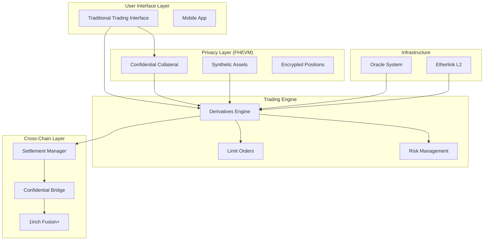

# Ascenda Smart Contracts - Technical Architecture & Execution Flows

## System Overview

Ascenda is a privacy-preserving derivatives platform for real-world assets that combines traditional finance UX with confidential DeFi infrastructure. The smart contract system enables users to trade derivatives on stocks, commodities, and bonds while maintaining complete privacy of positions, trades, and portfolio values.

### Core Design Principles

- **Privacy-First**: All sensitive financial data encrypted using FHEVM
- **Familiar UX**: Traditional brokerage interface hiding DeFi complexity  
- **Cross-Chain**: Seamless atomic swaps via 1inch Fusion+ integration
g

## Contract Architecture

### Layer 1: Core Infrastructure
- **AscendaOracle**: Price feeds for real-world assets via Chainlink + manual updates
- **AscendaConfidentialCollateral**: Privacy-preserving USDC wrapper using FHEVM
- **AscendaSyntheticAsset**: Confidential tokens representing RWA exposure

### Layer 2: Trading Engine
- **AscendaDerivativesEngine**: Main derivatives trading with encrypted positions
- **LimitOrderManager**: Advanced order strategies via 1inch Limit Order Protocol
- **CrossChainSettlementManager**: Atomic cross-chain settlements via 1inch Fusion+

### Layer 3: Privacy & Cross-Chain
- **ConfidentialCrossChainBridge**: Privacy-preserving cross-chain transfers
- **Risk management modules**: Encrypted liquidation and margin calculations

## Execution Flows

### 1. User Onboarding & Collateral Deposit

**Objective**: Convert regular USDC to confidential cUSDC for private trading

**Flow Execution**:
1. User approves USDC spending to AscendaConfidentialCollateral contract
2. User calls `confidentialDeposit()` with desired amount
3. Contract transfers USDC from user to itself
4. Contract mints encrypted cUSDC tokens to user's address
5. Encrypted balance stored on-chain, only user can decrypt
6. User sees normal USDC balance in frontend (decrypted client-side)

**Privacy Guarantees**: 
- Deposit amounts encrypted using FHEVM
- Only user holds decryption keys
- Observers see encrypted values only

**Gas Optimization**: 
- Batch deposits supported for multiple users
- ERC1363 integration allows single-transaction deposits

### 2. Opening Derivative Positions

**Objective**: Create confidential derivative positions on real-world assets

**Flow Execution**:
1. User selects asset (MTN, DANGOTESUGAR, TSLA, etc.) and derivative type (call, put, future)
2. Frontend encrypts position parameters (quantity, strike, premium) using FHEVM
3. User submits transaction with encrypted inputs + zero-knowledge proofs
4. AscendaDerivativesEngine validates proofs and asset support
5. Contract transfers encrypted collateral from user's cUSDC balance
6. Contract creates ConfidentialPosition struct with encrypted values
7. Contract emits PositionOpened event with public metadata only
8. User receives position ID and can decrypt their own position details

**Cross-Contract Interactions**:
- Oracle contract provides current asset prices
- Confidential collateral contract handles encrypted transfers
- Risk management validates collateralization ratios

**Privacy Protection**:
- Position sizes completely hidden from public
- Strike prices and premiums encrypted
- Only position owner can view decrypted details

### 3. Price Oracle Integration

**Objective**: Provide reliable price feeds while supporting privacy operations

**Flow Execution**:
1. AscendaOracle aggregates prices from multiple sources:
   - Chainlink feeds for major assets (primary)
   - Manual updates for assets without oracles (backup)
   - Cross-validation between sources
2. Price data includes staleness checks (1-hour threshold)
3. Derivatives engine queries current prices for position valuation
4. Oracle returns PriceData struct with validation flags
5. Encrypted calculations use current prices for P&L computation

**Reliability Features**:
- Fallback mechanism if Chainlink feeds fail
- Batch price updates for gas efficiency
- Price staleness protection prevents manipulation
- Multi-source validation for critical operations

### 4. Confidential P&L Calculation

**Objective**: Calculate position profits/losses while maintaining privacy

**Flow Execution**:
1. System retrieves current asset price from oracle
2. Current price converted to encrypted euint64 format
3. Encrypted P&L calculated based on position type:
   - **Calls**: max(currentPrice - strikePrice, 0) × quantity - premium
   - **Puts**: max(strikePrice - currentPrice, 0) × quantity - premium
   - **Futures**: (currentPrice - strikePrice) × quantity
4. All calculations performed using FHEVM encrypted math operations
5. Result remains encrypted until user requests decryption
6. User can view their P&L through frontend decryption

**Mathematical Operations**:
- Encrypted comparison operations (gt, lt, gte, lte)
- Conditional selection using encrypted booleans
- Safe arithmetic with overflow protection
- Zero-knowledge verification of calculation correctness

### 5. Position Closing & Settlement

**Objective**: Close positions and settle profits/losses confidentially

**Flow Execution**:
1. User initiates position close through frontend
2. System calculates final P&L using current market prices
3. Settlement amount = collateral + P&L (encrypted calculation)
4. Contract updates position status to CLOSED
5. Encrypted settlement amount transferred back to user's cUSDC balance
6. Position marked as closed with timestamp
7. User can decrypt final settlement amount

**Settlement Variations**:
- **Manual Close**: User-initiated before expiration
- **Expiration**: Automatic settlement at contract expiration
- **Liquidation**: Forced closure if collateral insufficient

### 6. Cross-Chain Settlement via 1inch Fusion+

**Objective**: Enable atomic cross-chain position settlement while preserving privacy

**Flow Execution**:
1. User requests cross-chain settlement to different L2/L1
2. CrossChainSettlementManager creates atomic swap order:
   - Generates secret hash for atomic swap security
   - Locks encrypted collateral in escrow contract
   - Creates 1inch Fusion+ order with swap parameters
3. Professional resolvers compete to fulfill the order:
   - Resolver deposits equivalent tokens on destination chain
   - Resolver reveals secret to claim source chain tokens
   - User receives settlement on destination chain
4. Timelock protection ensures refund if swap fails
5. All amounts remain encrypted throughout process

**Atomic Swap Security**:
- Hash time-locked contracts (HTLC) ensure atomicity
- Secret revelation required for completion
- Automatic refund if timelock expires
- Professional resolver network ensures liquidity

### 7. Advanced Order Strategies

**Objective**: Execute complex multi-leg derivative strategies

**Flow Execution**:
1. User composes strategy (bull call spread, iron condor, etc.)
2. LimitOrderManager validates strategy logic:
   - Verifies all legs use same underlying asset
   - Confirms expiration dates match where required
   - Validates strike price relationships
3. Individual orders created for each strategy leg
4. 1inch Limit Order Protocol integration for advanced execution:
   - Conditional logic for strategy completion
   - Automated execution when market conditions met
   - Professional market maker competition for best prices
5. Strategy marked complete when all legs filled

**Strategy Examples**:
- **Bull Call Spread**: Buy low strike call + sell high strike call
- **Iron Condor**: Sell put spread + sell call spread
- **Covered Call**: Long stock position + short call

### 8. Risk Management & Liquidation

**Objective**: Maintain system solvency while preserving user privacy

**Flow Execution**:
1. Continuous monitoring of encrypted position values
2. Risk calculations performed using FHEVM operations:
   - Current position value vs collateral requirements
   - Liquidation threshold checks (110% collateralization)
   - Portfolio-level risk aggregation
3. Liquidation trigger conditions:
   - Position value drops below liquidation threshold
   - User fails to meet margin calls
   - Position expires out-of-the-money
4. Liquidation execution:
   - Liquidator calls liquidation function
   - System validates liquidation conditions
   - Position closed at current market prices
   - Liquidator receives bonus (5% of recovered value)
   - Remaining value returned to position owner

**Privacy-Preserving Risk Management**:
- Liquidation thresholds calculated with encrypted values
- Position health checks use confidential math
- Liquidators can trigger without seeing exact amounts
- Risk metrics aggregated across encrypted positions

### 9. Synthetic Asset Creation

**Objective**: Create tokenized exposure to real-world assets with privacy

**Flow Execution**:
1. User requests synthetic asset exposure (sAAPL, sTSLA, etc.)
2. System calculates required collateral (150% of exposure value)
3. AscendaSyntheticAsset contract mints confidential tokens:
   - Collateral locked in encrypted amount
   - Synthetic tokens minted to user (encrypted quantity)
   - Collateralization ratio tracked confidentially
4. User receives synthetic tokens representing RWA exposure
5. Synthetic tokens can be traded, used as collateral, or redeemed

**Collateralization Management**:
- Dynamic collateral requirements based on volatility
- Automated liquidation if collateral insufficient
- Rebalancing mechanisms for stable backing
- Integration with derivatives engine for complex strategies

### 10. Confidential Cross-Chain Bridge

**Objective**: Transfer confidential tokens between chains while maintaining privacy

**Flow Execution**:
1. User initiates cross-chain transfer via ConfidentialCrossChainBridge
2. Bridge locks encrypted tokens on source chain:
   - Amount encrypted and stored in escrow
   - Secret hash generated for atomic swap
   - Timelock set for automatic refund
3. Resolver deposits equivalent tokens on destination chain
4. Atomic swap completion:
   - User reveals secret to claim destination tokens
   - Resolver uses same secret to claim source tokens
   - Privacy maintained throughout process
5. Failed transfers automatically refunded after timelock

**Cross-Chain Privacy**:
- Transfer amounts remain encrypted on both chains
- Bridge operators cannot see transaction values
- Atomic swap ensures security without trust
- User controls privacy through secret management

## Integration Points

### External Protocol Integration
- **1inch Limit Order Protocol**: Advanced order management and execution
- **1inch Fusion+**: Cross-chain atomic swaps and settlement
- **Chainlink Oracles**: Reliable price feeds for real-world assets
- **FHEVM**: Fully homomorphic encryption for confidential computing

### Frontend Integration Requirements
- **FHEVM client library**: For encrypting inputs and decrypting outputs
- **MetaMask compatibility**: Standard wallet integration
- **Real-time price feeds**: WebSocket connections for live data
- **GraphQL subscriptions**: Real-time position and portfolio updates

### Monitoring & Analytics
- **Event indexing**: Position and trading activity tracking
- **Performance metrics**: System health and usage statistics
- **Privacy analytics**: Encrypted data insights without revealing values
- **Compliance reporting**: Selective disclosure for regulatory requirements

## Deployment Architecture

### Network Configuration
- **Primary deployment**: Etherlink mainnet for MEV protection
- **Cross-chain support**: Ethereum, Arbitrum, Polygon integration
- **Testnet environments**: Comprehensive testing infrastructure
- **Staging environment**: Pre-production validation

### Contract Dependencies
- **OpenZeppelin libraries**: Security and standard implementations
- **FHEVM contracts**: Confidential computing infrastructure
- **1inch protocol contracts**: Advanced trading functionality
- **Chainlink contracts**: Oracle price feed integration

